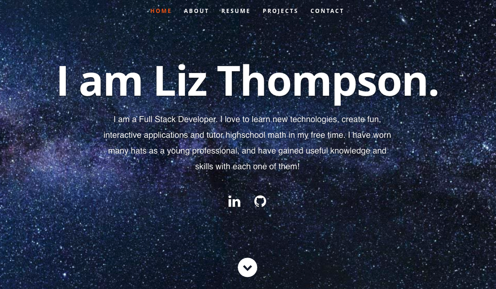
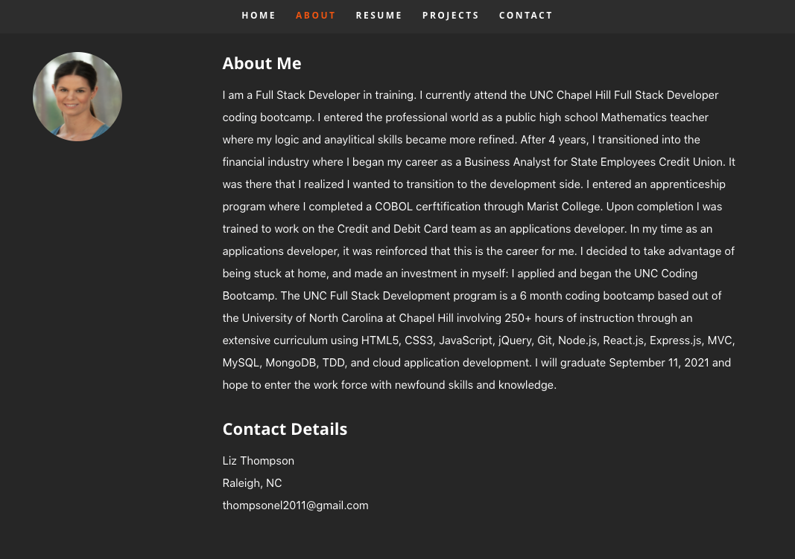
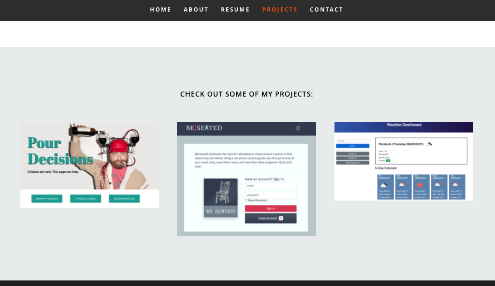
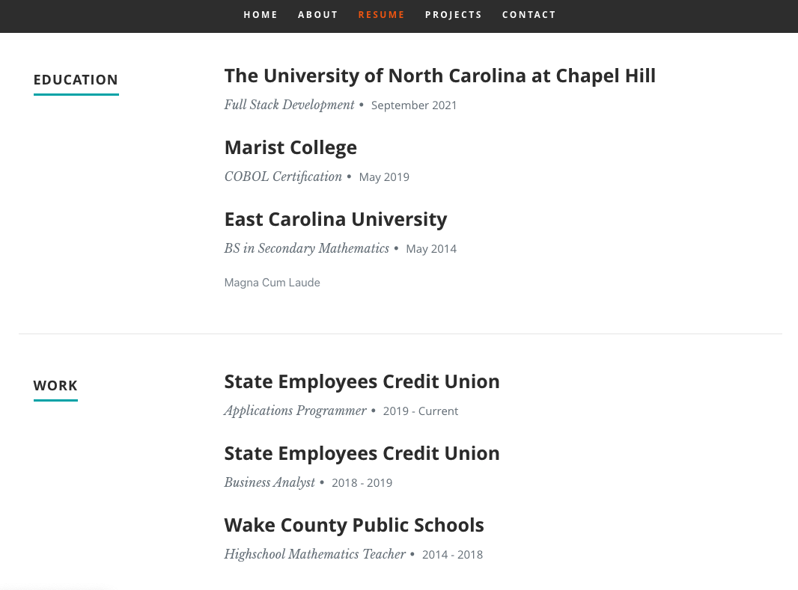
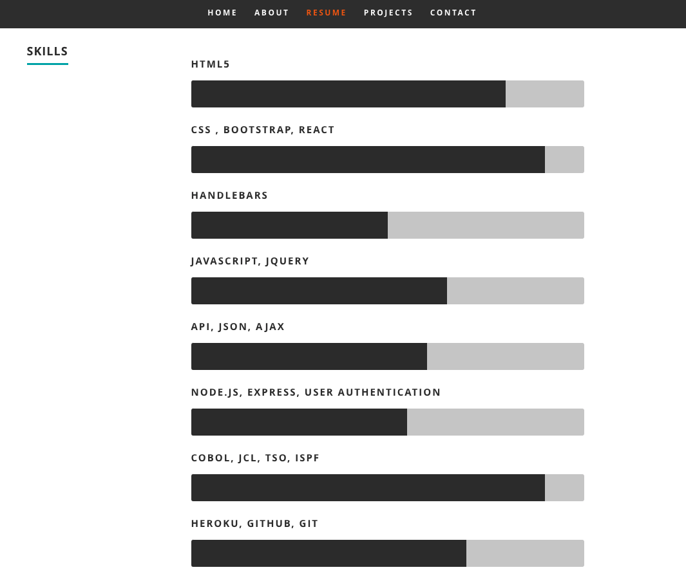
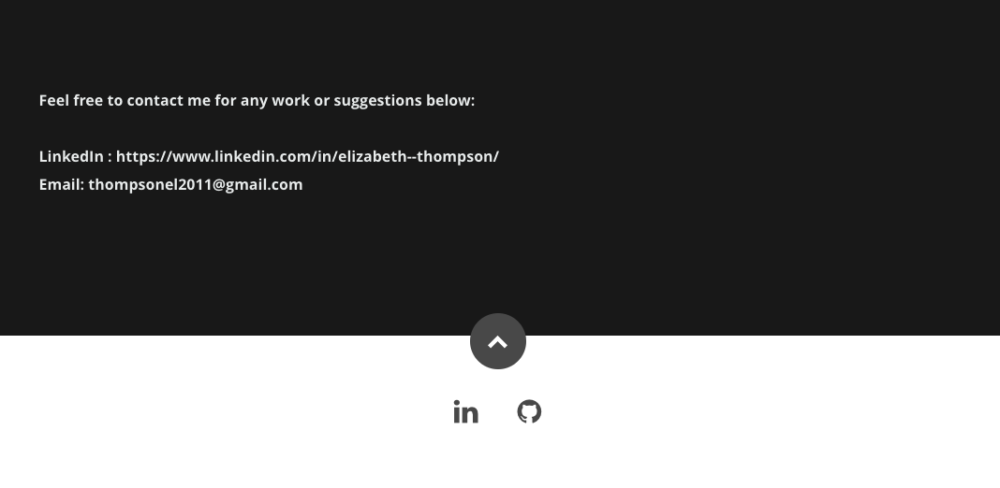

# React Portfolio

The purpose of this webpage is to create a professional portfolio to display work, contact information, and information about myself. 

## Navigation Bar

The navigation bar is located in the top portion of the home page. When you select the "About", "Resume", "Projects", or "Contact" tabs, you will be directed to the corresponding content on the webpage.   

## About

The "About" (me) portion of this webpage contains a photo, contact information, and a brief description of how I got to this point in my profession. This portion of the webpage can be accessed by clicking on the "about" tab on the navigation bar.

## Projects

The "Projects" portion of this webpage contains three sample applications I have built. When the user clicks on the image, he/she will be directed to the webpage. When the user hovers the image, he/she will see a description of the project and what technologies were used. The "Projects" portion of this webpage can be easily accessed by selecting the "Projects" tab on the navigation bar. 

## Resume

The "Resume" tab on the webpage's navigation bar will direct you to a portion of the webpage that contains my education, work experience, and skills. 

## Contact 

The "Contact" portion of this webpage contains icons that are linked to my LinkedIn and GitHub, as well as my email address.  This portion of the webpage can be accessed by clicking on the "Contact" tab on the navigation bar. 

### Portfolio IO: 
 https://thompsonel11.github.io/reactPortfolio/

### GitHub Repo: 
https://github.com/thompsonel11/reactPortfolio

